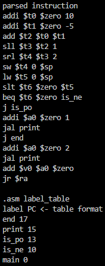
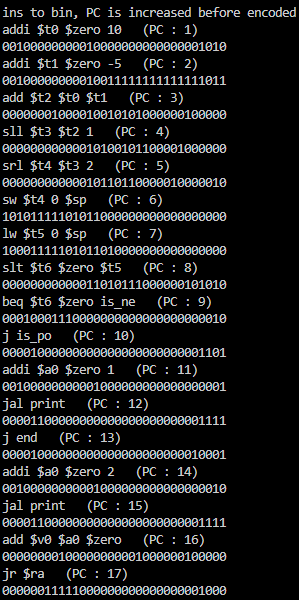

## 프로젝트 1 검증 방법 2020203090 한용옥

### 프로그램 실행 방법

1. 모든 `.cpp`, `.h`파일을 한 경로에 넣는다
2. `main.cpp`를 연다
3. 전역 변수 `file_path`에 인코딩할 `.asm`파일의 경로를 적는다
4. 전역 변수 `out_path`에 인코딩된 파일의 경로를 적는다
5. `main.cpp`를 실행한다

### 프로그램 모드 설정
`main.cpp`의 전역 변수 `debug` 가
`true`면 콘솔에 토큰화된 명령어, 라벨 테이블, 각 명령어, PC, 인코딩된 명령어가 출력,
`.asm`을 읽어 `.bin`으로 인코딩
`false`면 아무것도 뜨지 않은 채 `.asm`을 읽어 `.bin`으로 인코딩

### `.asm` 설정
`.asm` 입력 형식 오류는 가정하지 않음
1. 라벨은 공백없이 `:`로 마무리
2. 모든 토큰은 공백으로 분리
3. `#` 뒤는 모두 무시됨(주석이므로)
등등 정상적인 입력 가정

### 테스트한 파일 및 인코딩 결과


``` assembly
main:
    addi $t0, $zero, 10     # $t0 = 10 (i형, 양수 즉시값)
    addi $t1, $zero, -5     # $t1 = -5 (i형, 음수 즉시값)
    add  $t2, $t0, $t1      # $t2 = $t0 + $t1 (r형, 산술)
    
    sll  $t3, $t2, 1        # $t3 = $t2 * 2 (r형, 시프트)
    srl  $t4, $t3, 2        # $t4 = $t3 / 4 (산술 시프트)

    sw   $t4, 0($sp)        # 메모리 저장 (메모리 접근)
    lw   $t5, 0($sp)        # 메모리 로드

    slt  $t6, $zero, $t5    # $t6 = ($zero < $t5)? 1 : 0 (음수 판별)
    beq  $t6, $zero, is_ne  # if $t5 <= 0 jump to is_negative
    j    is_po              # 양수이면 is_positive로 jump

is_ne:
    addi $a0, $zero, 1      # $a0 = 1 (음수 분기 확인용)
    jal  print              # 함수 호출
    j    end                # 종료

is_po:
    addi $a0, $zero, 2      # $a0 = 2 (양수 분기 확인용)
    jal  print       # 함수 호출

print:
    add  $v0, $a0, $zero    # 반환값 세팅
    jr   $ra                # 복귀

end:
```
**위는 `test.asm` 파일 내용**

```
00100000000010000000000000001010
00100000000010011111111111111011
00000001000010010101000000100000
00000000000010100101100001000000
00000000000010110110000010000010
10101111101011000000000000000000
10001111101011010000000000000000
00000000000011010111000000101010
00010001110000000000000000000010
00001000000000000000000000001101
00100000000001000000000000000001
00001100000000000000000000001111
00001000000000000000000000010001
00100000000001000000000000000010
00001100000000000000000000001111
00000000100000000001000000100000
00000011111000000000000000001000
```
**위는 `test.bin` ( = 인코딩 결과) 내용**

 

**위는 `debug == true`시 콘솔 출력 결과**

### 인코딩 결과 복원 분석

### 1. `001000 00000 01000 0000000000001010`

| 자리 | 변환 |
|:--:|:--|
|opcode | `001000` → `addi`|
|rs | `00000` → `$zero`|
|rt | `01000` → `$t0`|
|imm | `0000000000001010` → 10|  

복원 결과 :  `addi $t0, $zero, 10`

### 2. `001000 00000 01001 1111111111111011`

| 자리 | 변환 |
|:--:|:--|
|opcode| `001000` → `addi`|
|rs| `00000` → `$zero`|
|rt| `01001` → `$t1`|
|imm| `1111111111111011` → -5 (2의 보수)| 

복원 결과 :  `addi $t1, $zero, -5`

### 3. `000000 01000 01001 01010 00000 100000`

| 자리 | 변환 |
|:--:|:--|
|opcode| `000000` → R-type|
|rs| `$t0`|
| rt| `$t1`|
| rd| `$t2`|
|funct| `100000` → `add`|  

복원 결과 :  `add $t2, $t0, $t1`

### 4. `000000 00000 01010 01011 00001 000000`

| 자리 | 변환 |
|:--:|:--|
| opcode | `000000` → R-type |
| rs | `$zero` |
| rt | `$t2` |
| rd | `$t3` |
| shamt | `00001` = 1 |
| funct | `000000` → `sll` |

복원 결과 : `sll $t3, $t2, 1`

### 5. `000000 00000 01011 01100 00100 000010`

| 자리 | 변환 |
|:--:|:--|
| opcode | `000000` → R-type |
| rs | `$zero` |
| rt | `$t3` |
| rd | `$t4` |
| shamt | `00010` = 2 |
| funct | `000010` → `srl` |

복원 결과 : `srl $t4, $t3, 2`

### 6. `101011 11101 01100 0000000000000000`

| 자리 | 변환 |
|:--:|:--|
| opcode | `101011` → `sw` |
| base | `$sp` |
| rt | `$t4` |
| offset | 0 |

복원 결과 : `sw $t4, 0($sp)`

### 7. `100011 11101 01101 0000000000000000`

| 자리 | 변환 |
|:--:|:--|
| opcode | `100011` → `lw` |
| base | `$sp` |
| rt | `$t5` |
| offset | 0 |

복원 결과 : `lw $t5, 0($sp)`

### 8. `000000 00000 01101 01110 00000 101010`

| 자리 | 변환 |
|:--:|:--|
| opcode | `000000` → R-type |
| rs | `$zero` |
| rt | `$t5` |
| rd | `$t6` |
| funct | `101010` → `slt` |

복원 결과 : `slt $t6, $zero, $t5`

### 9. `000100 01110 00000 0000000000000010`

| 자리 | 변환 |
|:--:|:--|
| opcode | `000100` → `beq` |
| rs | `$t6` |
| rt | `$zero` |
| offset | 2 (`is_ne`는 두 줄 뒤에 위치)|

복원 결과 : `beq $t6, $zero, is_ne`

### 10. `000010 00000000000000000000001101`

| 자리 | 변환 |
|:--:|:--|
| opcode | `000010` → `j` |
| address | 13 (`is_po` 의 PC)|

복원 결과 : `j is_po`

### 11. `001000 00000 00100 0000000000000001`

| 자리 | 변환 |
|:--:|:--|
| opcode | `001000` → `addi` |
| rs | `$zero` |
| rt | `$a0` |
| imm | 1 |

복원 결과 : `addi $a0, $zero, 1`

### 12. `000011 00000 00000000000000001111`

| 자리 | 변환 |
|:--:|:--|
| opcode | `000011` → `jal` |
| address | 15 (`print` 의 PC)|

복원 결과 : `jal print`

### 13. `000010 00000000000000000000010001`

| 자리 | 변환 |
|:--:|:--|
| opcode | `000010` → `j` |
| address | 17 (`end` 의 PC)|

복원 결과 : `j end`

### 14. `001000 00000 00100 0000000000000010`

| 자리 | 변환 |
|:--:|:--|
| opcode | `001000` → `addi` |
| rs | `$zero` |
| rt | `$a0` |
| imm | 2 |

복원 결과 : `addi $a0, $zero, 2`

### 15. `000011 00000 00000000000000001111`

| 자리 | 변환 |
|:--:|:--|
| opcode | `000011` → `jal` |
| address | 15 (`print` 의 PC)|

복원 결과 : `jal print`

### 16. `000000 01000 00000 00100 00000 100000`

| 자리 | 변환 |
|:--:|:--|
| opcode | `000000` → R-type |
| rs | `$a0` |
| rt | `$zero` |
| rd | `$v0` |
| funct | `100000` → `add` |

복원 결과 : `add $v0, $a0, $zero`

### 17. `000000 11111 00000 00000 00000 001000`

| 자리 | 변환 |
|:--:|:--|
| opcode | `000000` → R-type |
| rs | `$ra` |
| funct | `001000` → `jr` |

복원 결과 : `jr $ra`

### 결론

각 명령어는 그에 맞는 opcode, 레지스터 필드, 즉시값, 주소 필드 등으로 정확하게 인코딩됨
분기 및 함수 호출 주소도 올바르게 설정되어 있다